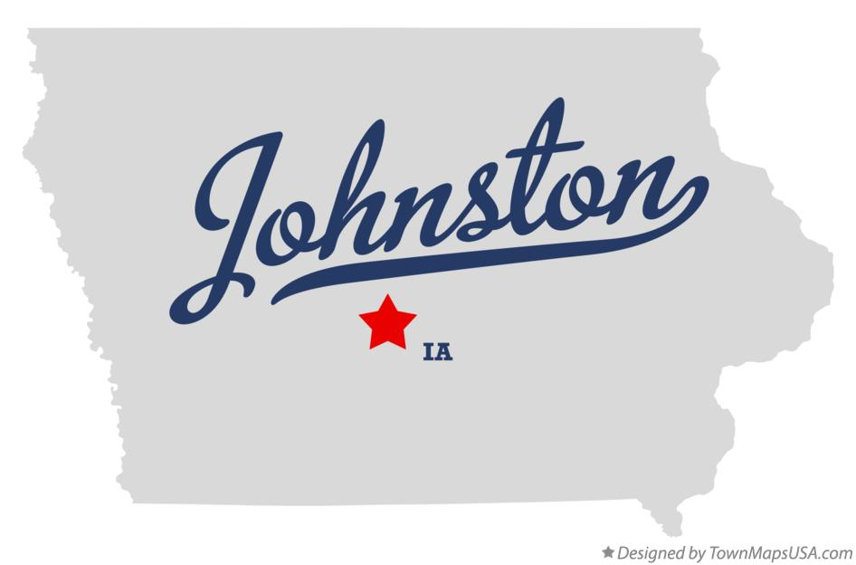

```{r setup, include=FALSE}
knitr::opts_chunk$set(echo = FALSE)
library(tidyverse)
library(lubridate)

```

# This is a presentation!

## Where I am from 
* Johnston, Iowa


<center></center> 

```{html}
<div class="notes">
Notes for slide.
- I've been in IA my entire life 
</div>
```

## What am I doing here at ISU?
* Getting my PhD in Agricultural Meteorology 

## Cool paper
This is a cool paper that I found [@challinoretal2014projyields]

## Attempting to output code
* Below is the summary of the cars dataset 
```{r cars, echo = TRUE}
summary(cars)
```

## Here is a plot!
* Below is a plot made from the pressure data set

```{r pressure, echo=FALSE}
pressure%>%
  ggplot(aes(x=temperature, y=pressure)) + 
  geom_point(size=1) +
  stat_smooth()
```

##References 
